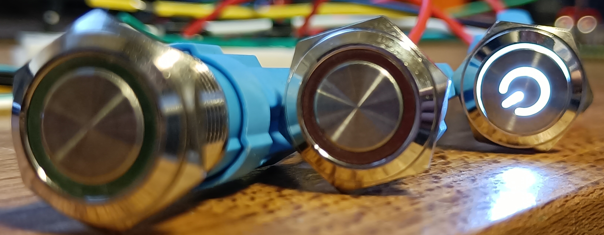
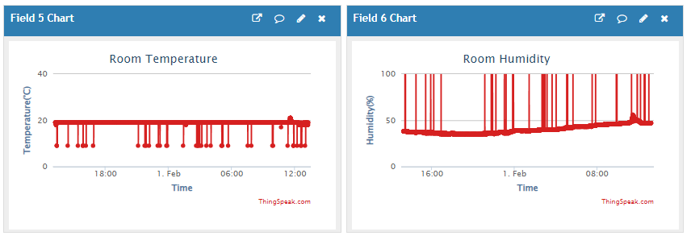
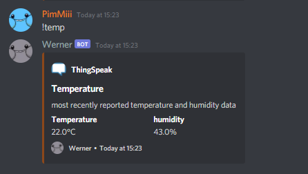
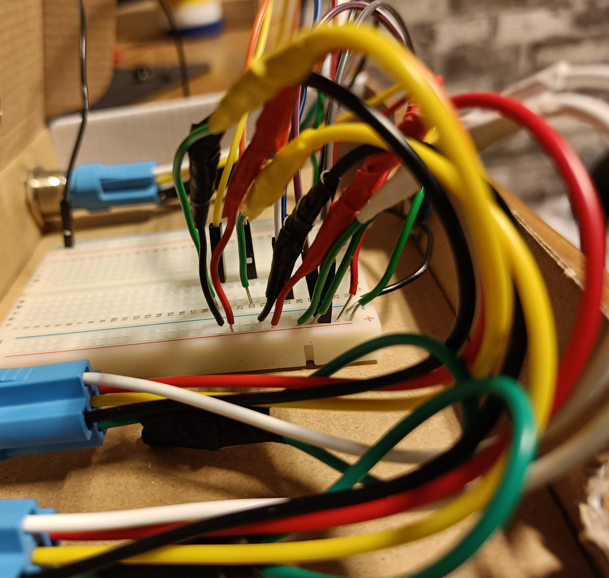
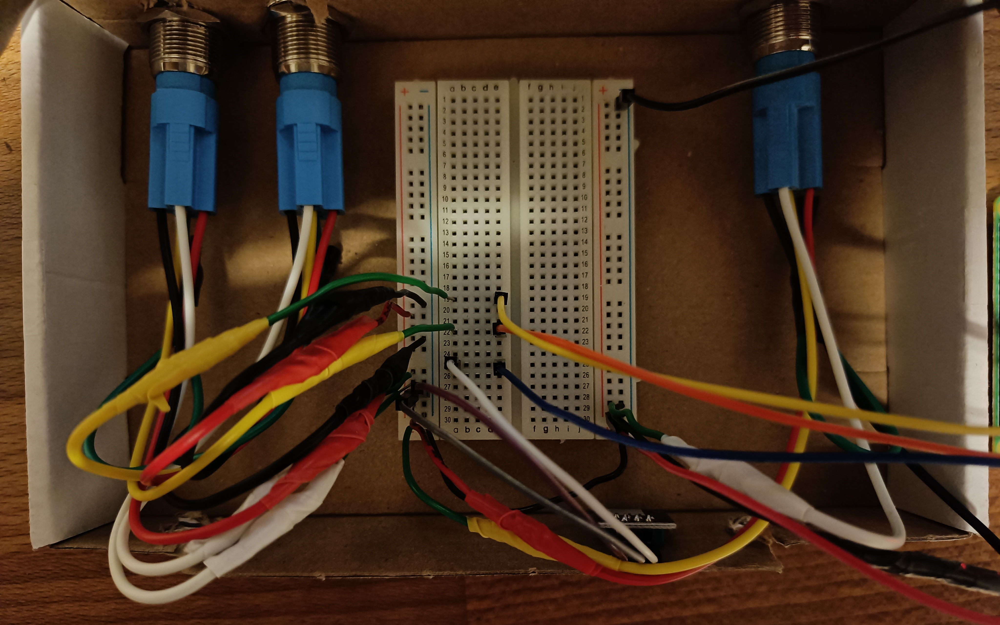
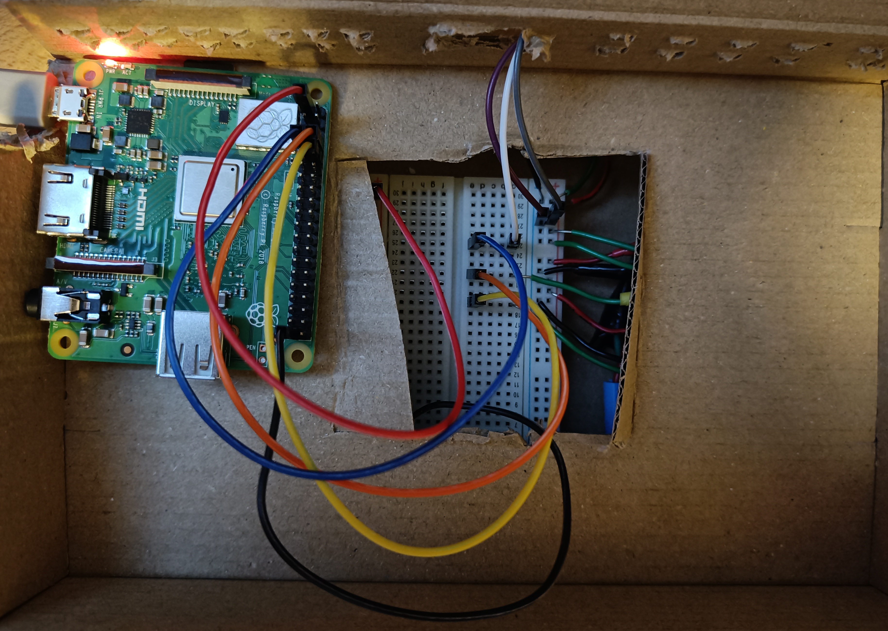
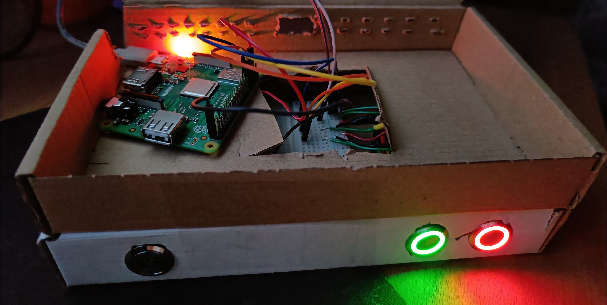
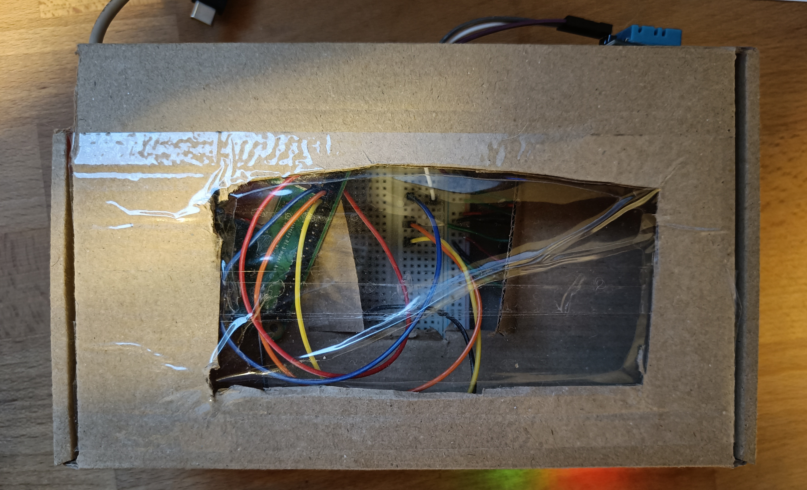
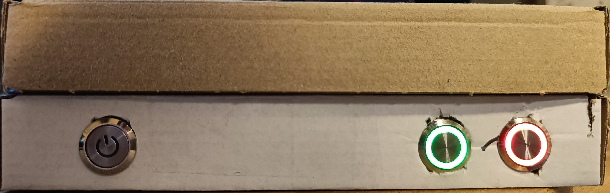
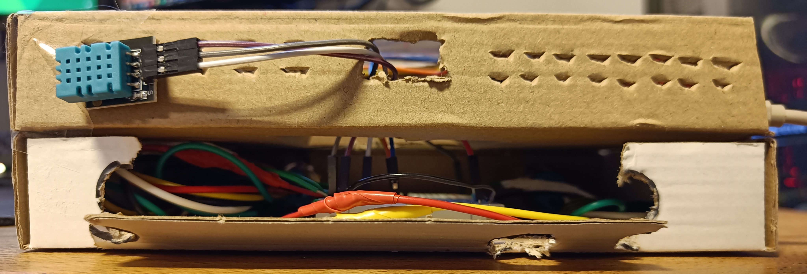

# Data-Science-IoT-KP02
Data-Science-IoT Keuzevak HR periode 02 2022.

# PRiTC
***P***ositive ***R***e***i***nforcement upon ***T***ask ***C***ompletion

<a href="https://youtu.be/Oq14UJqhHEA">youtube: PRiTC demonstration </a>  
[](https://www.youtube.com/watch?v=JOLxFL0_3Nk)  

### Problem
I seem to have a pattern of procrastination, which sooner rather than later will come to haunt me.

Maybe it already has, seeing how my first idea for a project was a 'smart' (read ring-like) doorbell,
but knowing virtually nothing about image processing makes that seem like a daunting task,
especially if it needs to be finished before the deadline.  

### Goal of the Project
So on to the current idea: **PRiTC**.  
Positive Reinforcement upon Task Completion, a discord bot sending positive and encouraging messages to myself.  
The idea sounds simple enough yet effective.    

The Internet-of-Things application consists of a RPi3a+, 3 buttons, and a DHT11 (temp and humidity) sensor.  
Data collected includes Humidity, Room temperature, Start and end time for a task, it's completion status
(finished or cancelled) and it's duration in seconds.    
Data gets send to ThingSpeak, from where the Discord-bot can read
it through the ThingSpeak API. Data on ThingSpeak can be used to visualize correlation between temp and humidity
(comes pre-configured through MATLAB), but also in the future with enough data-points collected maybe find a pattern between
room temp/humidity and my ability to finish tasks.    
In other words to visualize at what room temp/humidity I am most productive.
  
In terms of learning goals, I'd say becoming more comfortable with the hardware side of things.  
But also getting more comfortable navigating the commandline by using the pi through SSH/ the commandline.  
Getting to play around with a IoT/data science pipeline is a welcome addition as well, and a new experience for sure.  
Furthermore, general coding/programming experience is always welcome.  
And finally, personal-growth/ learning would come from the overall end goal of the project, the positive reinforcement, and learning
to be more positive towards myself.    

### Prior experience
Prior experiences for this project are:
- My Project in the First Period of this schoolyear: <a href="https://makecode.adafruit.com/90475-47648-89981-11445">
Trashy</a>.  
It's relevant due to it also being an IoT project. So this was the first time I worked with sensors, soldering,
electrical wires, and in/output to a microcontroller. In the case of Trashy this was a Circuit Playground Express.  
I could use this experience directly in this course and project.
- My Project for the current (second) period of this schoolyear: <a href="https://github.com/PimMiii/cmgthrcle2">Webshop: EasyGoods</a>.  
Due to this being the first time having to work with GET and POST requests. Which came in handy with sending and
retrieving to/from ThingSpeak.
- The Disccord-bot I once made as little project for myself, which I could refurbish (and update it's quite obsolete code)
to work for this project.
- And the past ten years (on and off) in which I ~~not so succesfully~~ tried to teach myself programming in Python through reading/ following along with
books like: Python Crash Course (by Eric Matthes), and others.

### Inspired by
For this project I mostly got inspired by my therapist (👋), my (in)ability to be just that little nicer to myself, 
my inability to keep to a planning I've made, and my knack for procrastination.  
Which I aim to try and combat with this project.

### Includes references from  
Code snippets (and the input/sensor test-scripts) are referenced from various sources.
- <a href="https://www.thegeekpub.com/236867/using-the-dht11-temperature-sensor-with-the-raspberry-pi/">The Geek Pub, USING THE DHT11 TEMPERATURE SENSOR WITH THE RASPBERRY PI. Posted by Mike Murray </a>
- <a href="https://sourceforge.net/p/raspberry-gpio-python/wiki/Home/">The RPi.GPIO python docs/wiki</a>
- <a href="https://discordpy.readthedocs.io/en/stable/index.html">The discord.py docs </a>
- <a href="https://docs.python-requests.org/en/master/user/quickstart/">The Requests python docs</a>
  

## The Project

### Pipeline


### Required hardware
- Raspberry Pi 3a+ or newer
- DHT11 sensor
- Breadboard
- Du Pont male-female jumper wires
- 2 (or 3) push buttons

### Thingspeak channel
Channel consists of 6 fields:
1. `task_status` (is task completed: 0 = cancelled/not completed, 1 = completed)
2. `task_start` (timestamp of the task starting time)
3. `task_end` (timestamp of the task ending time)
4. `task_duration` (time it took for task to be completed in seconds)
5. `temp` (Temperature reported by DHT11, Room Temperature in °C)
6. `humidity` (Humidity reported by DHT11)

### install requirements 
to install the required modules on RPi:  
```$ pip install -r requirements.txt ```

## The Process
I started off with just wiring up some buttons I already had onto a breadboard and the GPIO pins on the RPi.
And writing the first simple button_test.py script. just to turn on some LEDs.  
<a href="https://youtu.be/Oq14UJqhHEA">youtube: button test </a>  
[](https://youtu.be/Oq14UJqhHEA)  
After that I tested the DHT11 sensor, separately with the DHT11_Test.py script, and confirmed that it worked okay-ish.  
The DHT11 does seem prone to errors, and even still in the current prototype seems to exhibit some weird behaviour from
time to time.  

At the same time as the DHT11 sensor arrived, the new fancier buttons arrived as well, so time to test those and see
their fancy LED lights. 
 
I confirmed they worked as expected, but somewhere in the process (either during soldering or during wiring to the
breadboard) I seem to have fried the LEDs in the on/off button. 

Now it became time to combine the two test scripts into the main.py script. And that went over quite smoothly.
It's when it came time to start sending the data to ThingSpeak things took a turn... 

I couldn't seem to get the original given code working (py2), and never really noticed there was a py3 version given as well
in the course files, even after doing my own bit of converting it over from py2 urllib2 to py3 Requests module.  
Countless hours of 401 and 400 status codes, I gave up defeated for the night.  
The next day I decided to switch away from doing bulk updates to ThingSpeak and rather just do a single update at a time.
With a seemingly easier syntax, as it's just appending the fields and values as GET parameters to the update link.  
I finally got data to post to ThingSpeak. The reading of the Requests documentation had paid off.

Now that I had a script posting data to ThingSpeak it was time to let the script run through the night and see what data it produces.  
It turned out the DHT11 sends some spiky reading from time to time, which i still cant figure out. At first I figured
I must be sending reading errors to ThingSpeak, so I made sure there is no data transfer on DHT 11 reading errors. But still
I'm sometimes presented with spiky readings in ThingSpeak.


Writing the bot came with it's own struggles.  
At first the code I still had lying around didn't work anymore. It was for a way older version of discord.py than
the current one. So in I went to read the docs on discord.py to figure out what I had to change.  
With that figured out I could start formatting the data so that it would display nicely in discord.  
Using the embeds bots can send on discord, and through the relatively straightforward syntax discord.py has for these embeds,
this was a quick process.  
  
  
Now came the hardest and, for now, impossible problem to solve.  
How can I make the bot check the data from ThingSpeak every x seconds, and act on it when a task is reported as completed.  
the coroutine / async/await programming is still out of my league, and I'll have to do some learning and researching on
that kind of programming/structure before I can solve this problem I'm afraid.  
My first couple solutions weren't fruitious.

## The (working) Prototype

The prototype is nothing more than a bunch of wires, and 2 small cardboard boxes the components arrived in by mail.  
Held together by (packing) tape, with some holes cut into the cardboard for ventilation/ wires.  
And finally a hole on the top covered up with the same tape to create some sort of 'window' to peer into the innerwirings.  

### pictures


<small> there's a lot of wires coming from the buttons. the right most button is the on/off button.</small>








## Future Plans
Unfortunately I couldn't complete the project before the deadline.  
It is functional, but that's about it.  
  
So what would I like to add?
- Discord-bot messages upon task completion
- Discord-bot graph functionality (temp and humidity)
- Discord-bot graph/ stats functionality (task/day, task completion stats on different temp/humidity)
- Visualisation of the effect humidity/temp has on my productivity, if any.
- Average task duration stats
